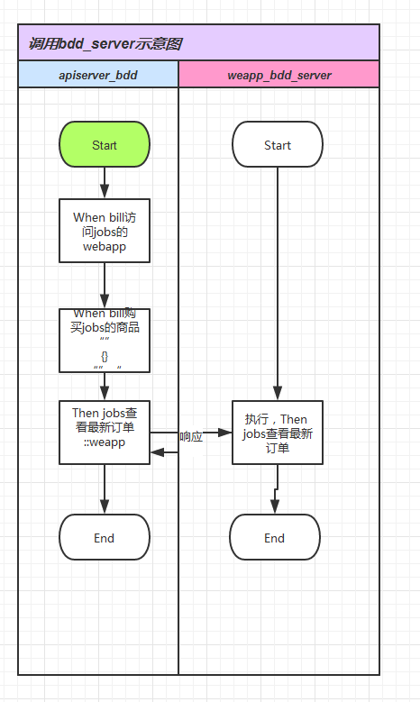

BDD_SERVER
----------------------

## 1.概述

### 基本功能

1. 具有bdd_server服务器，可供外部调用step
2. 具有call_bdd_server，可调用外部step


## 2. 使用指南

### 2.1 编写feature(*.feature文件)

1. 调用外部step的feature需要重置其环境，例：
		Given 重置'weapp'的bdd环境
		Given 重置'weizoom_card'的bdd环境
2. 调用外部step需要在step结尾增加标签`::{bdd_server_name}`, bdd_server_name指的是项目名称，如apiserver、weizoom_card,例：
		Given jobs已添加商品::weapp
3. `xxx::yyy`形式step已经被BDD_SERVER占用，不要新建此类型step。

### 2.2 编写、调试step实现（*_steps.py）
1. 可以和同一个项目中通过context传递上下文参数一样跨BDD_SERVER传递，如context.latest_order_id依然可用。
	1. 不能传递不可json序列化对象，也就是不能json.dumps的对象
	2. 如非必要，不推荐使用
2. 通常所有信息已经可以在执行behave命令的窗口看到，但是也许还有剩余的在BDD_SERVER窗口。

### 2.3 运行
1. 同单项目运行一样执行初始化，如执行相关rebuild.bat
2. 运行相关server和BDD_SERVER，即各项目的start_service.bat、start_bdd_server.bat

### 2.4 封装step

对于一个服务，可能并不关心其他服务创建数据的细节，所以可以把相关外部调用step封装成一个，而后又step实现去以子step的形式具体调用step。
典型案例(细节数据省略)：
```
	#创建微众卡
	Given test登录管理系统::weizoom_card
	When test新建通用卡::weizoom_card
		"""
		[]
		"""

	#微众卡审批出库
	When test下订单::weizoom_card
		"""
		[]
		"""

	When test下订单::weizoom_card
		"""
		[]
		"""

	#激活微众
	When test激活卡号'100000001'的卡::weizoom_card
	When test激活卡号'050000001'的卡::weizoom_card
	When test激活卡号'050000002'的卡::weizoom_card
	When test激活卡号'030000001'的卡::weizoom_card
	When test激活卡号'000000001'的卡::weizoom_card

	#调整有效期（没有实现对有效期调整的功能）
	#100000001：未使用
	#050000001：已使用
	#030000001：未使用
	#030000002：未激活
	#030000003：已过期
	#000000001：已用完

	And test批量激活订单'0002'的卡::weizoom_card
```
我们看到下单想使用一张微众卡很麻烦的，那么我们可以封装成一个step：
```
When 已创建微众卡:
"""
{
	.....
}
"""
```

实现：

```
@When(u'已创建微众卡')
def step_impl(context):
	context.execute_steps('Given test登录管理系统::weizoom_card')
	context.execute_steps('When test新建通用卡::weizoom_card')
	...
```


## 3. BDD_SERVER原理

### 3.1. 运行原理

简而言之，启动一个名为BDD_SERVER的http server，通过http的方式传递数据。

	1. 启动bdd_server服务。
	2. call_bdd_server解析behave step，并以http请求方式发送给bdd_server。
	3. bdd_server收到请求后解析成behave step，以子step（`context.execute_steps(step)`）方式执行。
	4. bdd_server执行完毕后把结果解析成http响应发回。
	5. call_bdd_server收到响应后，根据约定判定是否执行成功，以及显示信息。

如图：


如果图片没渲染出来，请查看<https://git2.weizzz.com:84/weizoom/bddserver/raw/master/bdd_server.png>

### 3.2. 文件结构

因为behave的限制，实现BDD_SERVER必须为此目录结构：

```
/.
│  start_bdd_server.bat
│  start_bdd_server.sh
│
├─bddserver
│      .gitignore
│      bdd_server_steps.py
│      call_bdd_server_steps.py
│      README.md
│      __init__.py
│
└─features
    │  environment.py
    │  __init__.py
    │
    ├─bdd_server
    │      bdd_server.feature
    │
    └─steps
            bdd_server_steps.py
            __init__.py

```


## 4. 维护

### 4.1. code-base

code-base中具有上述文件结构

### 4.2. 非code-base

1. 按照上述结构增加文件，参考code-base
2. bddserver是个特殊目录，实际上是git subtree，添加方法见下文

### 4.3. bddserver目录

为了能使各项目使用的BDD_SERVER保持一致，需要用git管理起来。又因为behave的本身限制，对于可能频繁变动的bdd_server_steps.py和call_bdd_server_steps.py文件，使用git subtree管理。对于上述两个，behave使用**step_library**描述（参见<https://github.com/behave/behave/blob/master/features/step.use_step_library.feature>）。

#### 4.3.1 step_library

参见：<https://github.com/behave/behave/blob/master/features/step.use_step_library.feature>

**step_library**是behave官方推荐的管理step库的方式，简而言之，step实现可以放在任何位置，然后在features/step/里有一个文件把它import进来，这就是features/step/bdd_server_steps.py的作用。

**注**： behave不支持steps目录中子目录的steps文件，参见<https://github.com/behave/behave/issues/169>。

### 4.3.2 subtree
#### 增加bdd_server子目录的方式

```
git remote add -f bddserver https://git2.weizzz.com:84/weizoom/bddserver.git
git subtree add --prefix=bddserver bddserver master --squash
```
**注**：上述subtree命令只能在git项目根目录执行，如果实际项目代码文件不在根目录（如weapp项目），需要--prefix时增加路径：
```
git subtree add --prefix=weapp/bddserver bddserver master --squash
```

#### 更新代码

因为subtree目录本身就是代码的一部分，所以按照git更新就可以了，而且只用一个人更新并提交代码即可。
如果没有增加过remote，需要第一次更新时候执行：
```
git remote add -f bddserver https://git2.weizzz.com:84/weizoom/bddserver.git
```

```
git subtree pull --prefix=bddserver bddserver master --squash
```

**注**：--prefix扔然要指定位置,如weapp更新：

```
git subtree pull --prefix=weapp/bddserver bddserver master --squash
```
